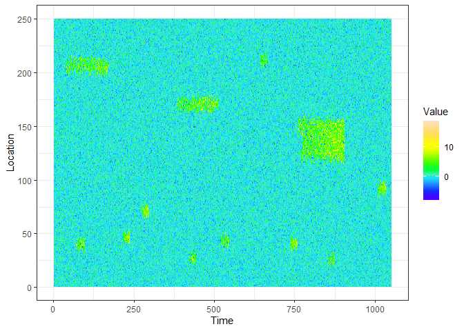
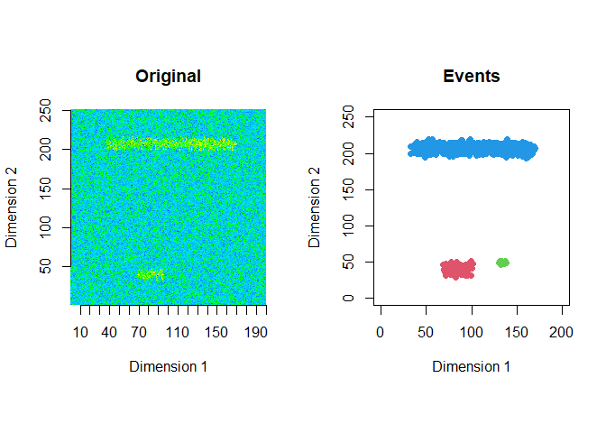
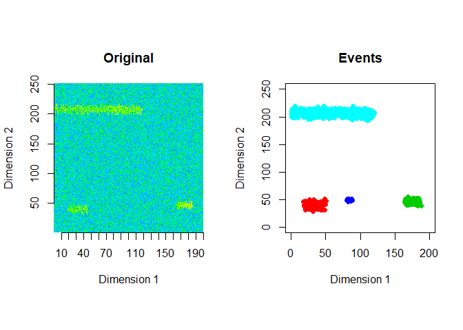
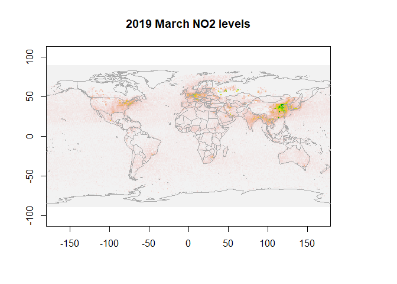
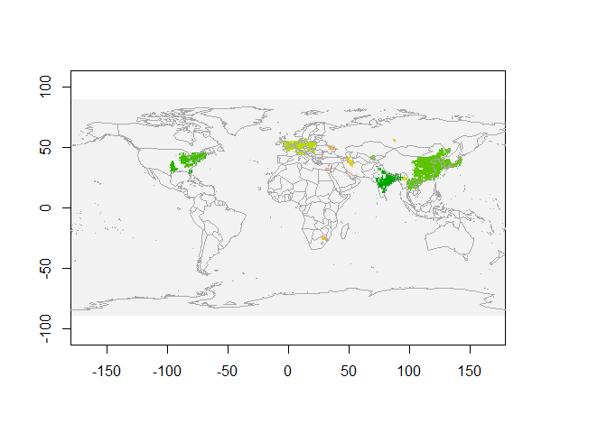

<!-- README.md is generated from README.Rmd. Please edit that file -->

# eventstream

<!-- badges: start -->
[](https://github.com/sevvandi/eventstream/actions)
<!-- badges: end -->

The goal of *eventstream* is to extract and classify events in
contiguous spatio-temporal data streams of 2 or 3 dimensions. For
details see (Kandanaarachchi, Hyndman, and Smith-Miles 2020).

## Installation

You can install the development version of *eventstream* from github
with:

``` r
#install.packages("devtools")
devtools::install_github("sevvandi/eventstream")
```

## Generate data - 2D

This is an example of a data stream you can generate with *eventstream*.

``` r
library("eventstream")
library("ggplot2")
library("raster")
#> Loading required package: sp
library("maps")

str <- gen_stream(3, sd=1)
zz <- str$data
dat <- as.data.frame(t(zz))
dat.x <- 1:dim(dat)[2]
dat.y <- 1:dim(dat)[1]
mesh.xy <- eventstream:::meshgrid(dat.x,dat.y)
xyz.dat <- cbind(as.vector(mesh.xy$x), as.vector(mesh.xy$y), as.vector(as.matrix(dat)) )
xyz.dat <- as.data.frame(xyz.dat)
colnames(xyz.dat) <- c("Time", "Location", "Value")
ggplot(xyz.dat, aes(Time, Location)) + geom_raster(aes(fill=Value)) +   scale_fill_gradientn(colours=topo.colors(12)) + theme_bw()
```



## Extract events - 2D

The extracted events are plotted for the first 2 windows using a window
size of 200 and a step size of 50.

``` r
zz2 <- zz[1:250,]
ftrs <- extract_event_ftrs(zz2, rolling=FALSE, win_size=200, step_size = 50, vis=TRUE)
```



## Extract events - 3D

To extract 3D events we use the NO2 data from NASA’s [NEO
website](https://neo.gsfc.nasa.gov/).

``` r
data(NO2_2019)
dim(NO2_2019)
#> [1]   4 179 360
ftrs_2019 <- extract_event_ftrs(NO2_2019, thres=0.97, epsilon = 2, miniPts = 20, win_size=4, step_size=1, rolling=TRUE, tt=1, vis=FALSE)
dim(ftrs_2019)
#> [1] 17 17  4
ftrs_2019[1, , ]
#>                             [,1]          [,2]          [,3]          [,4]
#> cluster_id             2.0000000     2.0000000     2.0000000     2.0000000
#> pixels                38.0000000    76.0000000    99.0000000   110.0000000
#> length                 1.0000000     2.0000000     3.0000000     4.0000000
#> width                 10.0000000    11.0000000    11.0000000    11.0000000
#> height                 7.0000000     8.0000000     8.0000000     8.0000000
#> total_value         7441.0000000 14168.0000000 18070.0000000 19973.0000000
#> l2w_ratio              0.1000000     0.1818182     0.2727273     0.3636364
#> centroid_x             1.0000000     1.5000000     1.8484848     2.0636364
#> centroid_y            57.0263158    56.7763158    56.8080808    56.8636364
#> centroid_z            84.3684211    84.4342105    84.5555556    84.5909091
#> mean                 195.8157895   186.4210526   182.5252525   181.5727273
#> std_dev               52.8029766    43.4561122    39.9692084    39.0289140
#> slope                  0.0000000   -18.7894737   -13.0818078    -7.5821510
#> quad1                  0.0000000     0.0000000   -18.5004700   -16.9542051
#> quad2                  0.0000000     0.0000000     4.6602897    11.0686499
#> sd_from_global_mean    0.8868751     0.8927779     0.8927779     0.8927779
#> Class                  0.0000000     0.0000000     0.0000000     0.0000000
```

The features contain 17 events, 17 features, and 4 age brackets for the
events.

First, let us visualize NO2 data for March 2019.

``` r
data(NO2_2019)
r <- raster(NO2_2019[1, ,],xmn=-179.5,xmx=179.5,ymn=-89.5,ymx=89.5,crs="+proj=longlat +datum=WGS84")
plot(r, legend=F, main="2019 March NO2 levels")
map("world",add=T, fill=FALSE, col="darkgrey")
```



## Visualize 2D cross sections of 3D events

Next we extract 3D events from March - June 2019. Then we visualize 2D
cross sections of these 3D events for March 2019.

``` r
data(NO2_2019)
output <- get_clusters_3d(NO2_2019, thres=0.97, epsilon = 2, miniPts = 20)
cluster.all <- output$clusters
xyz.high <- output$data
all_no2_clusters_march <- xyz.high[xyz.high[,1]==1,-1]
all_cluster_ids_march <- cluster.all$cluster[xyz.high[,1]==1]
cluster_ids_march <- all_cluster_ids_march[all_cluster_ids_march!=0]
no2_clusters_march <- all_no2_clusters_march[all_cluster_ids_march!=0,]

march_map <- matrix(0, nrow=180, ncol=360)
set.seed(123)
new_ids <- sample( length(unique(cluster_ids_march)),length(unique(cluster_ids_march)) )
new_cluster_ids <- cluster_ids_march
for(i in 1:length(unique(cluster_ids_march)) ) {
  new_cluster_ids[ cluster_ids_march== unique(cluster_ids_march)[i]] <- new_ids[i]
}

march_map[no2_clusters_march[,1:2]] <- new_cluster_ids
r <- raster(march_map,xmn=-179.5,xmx=179.5,ymn=-89.5,ymx=89.5,crs="+proj=longlat +datum=WGS84")
plot(r, legend=F)

map("world",add=T, fill=FALSE, col="darkgrey")
```



We see NO2 clusters extracted for March 2019 in the above figure. Each
colour represents a single cluster.

## References

<div id="refs" class="references csl-bib-body hanging-indent">

<div id="ref-eventstream" class="csl-entry">

Kandanaarachchi, Sevvandi, Rob J Hyndman, and Kate Smith-Miles. 2020.
“Early Classification of Spatio-Temporal Events Using Partial
Information.” *PLoS ONE* 15 (8): e0236331.

</div>

</div>
