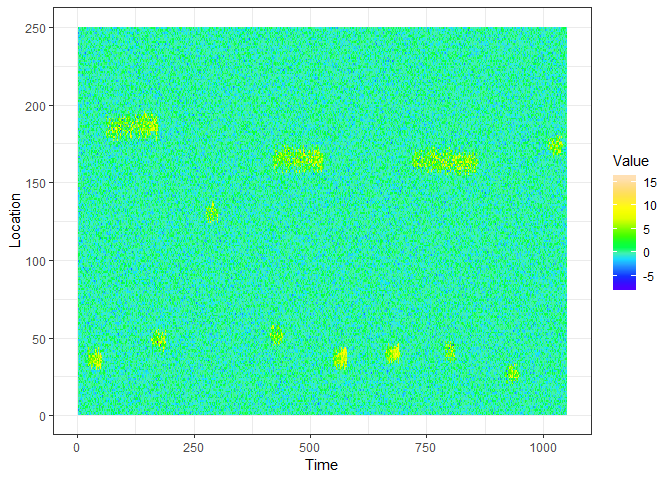
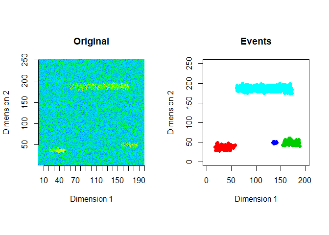
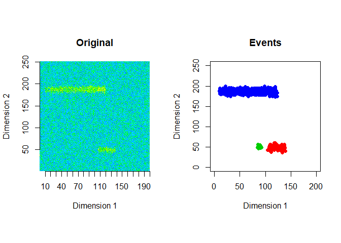

<!-- README.md is generated from README.Rmd. Please edit that file -->
eventstream
===========

[](https://travis-ci.org/sevvandi/eventstream)

The goal of *eventstream* is to extract and classify events in data streams. For details see (Kandanaarachchi, Hyndman, and Smith-Miles 2018). The R scripts used in the paper are at <https://github.com/sevvandi/eventstream_paper> .

This package is still under development and this repository contains a development version of the R package *eventstream*.

Installation
------------

You can install *eventstream* from github with:

``` r
#install.packages("devtools")
devtools::install_github("sevvandi/eventstream")
```

Generate data
-------------

This is an example of a data stream you can generate with *eventstream*. The extracted events are plotted for the first 2 windows using a window size of 200 and a step size of 50.

``` r
library("eventstream")
library("AtmRay")
library("ggplot2")
#> Warning: package 'ggplot2' was built under R version 3.5.2
str <- gen_stream(3, sd=1)
zz <- str$data
dat <- as.data.frame(t(zz))
dat.x <- 1:dim(dat)[2]
dat.y <- 1:dim(dat)[1]
mesh.xy <- AtmRay::meshgrid(dat.x,dat.y)
xyz.dat <- cbind(as.vector(mesh.xy$x), as.vector(mesh.xy$y), as.vector(as.matrix(dat)) )
xyz.dat <- as.data.frame(xyz.dat)
colnames(xyz.dat) <- c("Time", "Location", "Value")
ggplot(xyz.dat, aes(Time, Location)) + geom_raster(aes(fill=Value)) +   scale_fill_gradientn(colours=topo.colors(12)) + theme_bw()
```



``` r

zz2 <- zz[1:250,]
ftrs <- extract_event_ftrs(zz2,win_size=200, step_size = 50, vis=TRUE)
```



References
----------

Kandanaarachchi, Sevvandi, Rob J Hyndman, and Kate Smith-Miles. 2018. “Early Classification of Spatio-Temporal Events Using Time-Varying Models.” Working Paper 25/18. Department of Econometrics; Business Statistics. <https://www.researchgate.net/publication/329773142_Early_classification_of_spatio-temporal_events_using_time-varying_models>.
